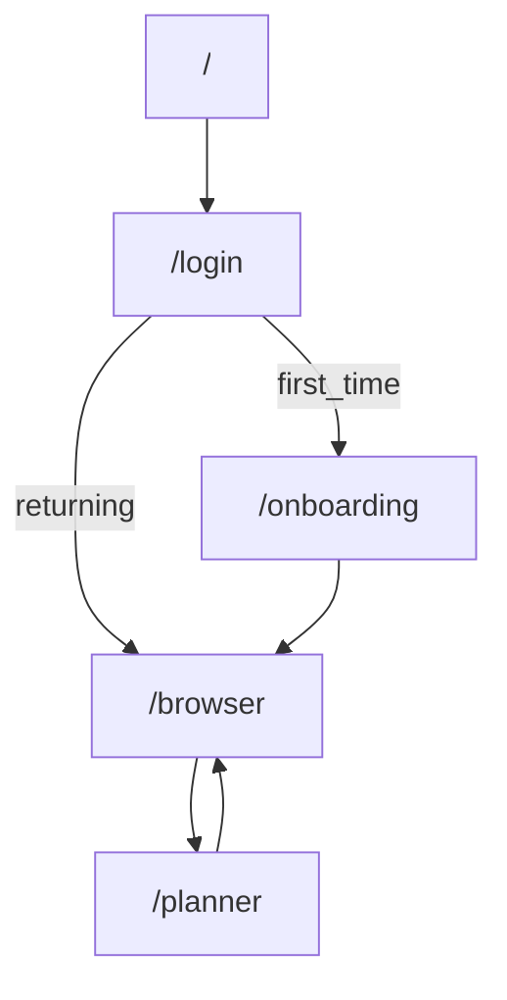

# Phase II: Unify + Restructure `web_dev_lc`

## Goals
- **One app, one URL base**: eliminate cross-port redirects and duplicated page implementations.
- **Standard user journey** inside one Next.js App Router project:
  - `/` (Landing) → `/login` → (`/onboarding` if first time) → `/browser` → `/planner`
- **Browser and Planner are separate features/pages**:
  - **Browser** = search/filter the full catalog and build a selection (shortlist/plan).
  - **Planner** = arrange the selected courses into a 4-year plan (no full catalog browser embedded).
- **Single source of truth** for course data shaping + plan/planner state to remove duplication (shared state, separate UIs).
- **Clean repo layout**: separate app code vs data vs docs.

## Current core folders (what stays “core”)
- **App code**
  - [`/Users/MatthewLi/Desktop/Senior Year/clubs/web_dev_lc/web/`](file:///Users/MatthewLi/Desktop/Senior%20Year/clubs/web_dev_lc/web): target monolith (Next.js 15.5 / React 19).
  - [`/Users/MatthewLi/Desktop/Senior Year/clubs/web_dev_lc/landing_page/`](file:///Users/MatthewLi/Desktop/Senior%20Year/clubs/web_dev_lc/landing_page): contains the best landing UI, but will be migrated in.
  - [`/Users/MatthewLi/Desktop/Senior Year/clubs/web_dev_lc/login_page/`](file:///Users/MatthewLi/Desktop/Senior%20Year/clubs/web_dev_lc/login_page): contains the best login UI, but will be migrated in.
- **Data**
  - [`/Users/MatthewLi/Desktop/Senior Year/clubs/web_dev_lc/prep_data/`](file:///Users/MatthewLi/Desktop/Senior%20Year/clubs/web_dev_lc/prep_data): source datasets; keep, but reorganize/rename.
  - [`/Users/MatthewLi/Desktop/Senior Year/clubs/web_dev_lc/FINALcatalog.json`](file:///Users/MatthewLi/Desktop/Senior%20Year/clubs/web_dev_lc/FINALcatalog.json): candidate canonical catalog.
- **Docs/notes**
  - [`/Users/MatthewLi/Desktop/Senior Year/clubs/web_dev_lc/debug&cleanup/`](file:///Users/MatthewLi/Desktop/Senior%20Year/clubs/web_dev_lc/debug%26cleanup): keep as documentation (can later move under `docs/`).

## Duplicate page implementations you must choose between (canonical “keepers”)
These are duplicates for the **3 pages in the target flow**; you said you’ll pick which to keep.
- **Landing (`/`)**
  - `landing_page/src/pages/Home.tsx` (marketing landing UI)
  - `web/src/app/page.tsx` (currently an outdated course browser sitting at `/` — should be replaced by the landing UI)
- **Login (`/login`)**
  - `login_page/src/app/login/page.tsx` (login UI)
  - (redirect-only helper) `login_page/src/app/page.tsx` (`/` → `/login` inside `login_page`) Delete this if not serving any real purpose.
- **Course Browser (`/browser`)** (page + logic)
  - `web/src/app/browser/page.tsx` (canonical browser UI)
  - (legacy/duplicate browser implementation at `/`) `web/src/app/page.tsx` Delete this.
  - (duplicated browser logic embedded inside planner) `web/src/app/planner/page.tsx` (the browser portion should be removed)
- **Planner (`/planner`)** (page should be planner-only)
  - `web/src/app/planner/page.tsx` (currently mixes planner + embedded browser; Phase II will split so this route only contains planner UI)

## Standard navigation + user flow (best practice)
### Route map

### Navigation rules
- **Internal navigation**: use Next.js `Link` + `useRouter().push()` (no `window.location.href` for internal routes).
- **Feature separation**: do not embed the entire catalog browser (drawer/search/filter) inside `/planner`. Planner should link out to `/browser` to add more courses, or deep-link to `/browser` for course picking, then return.
- **Route guarding** (lightweight, since auth is currently “mock”):
  - Require a simple “session cookie” for `/browser`, `/planner`, `/onboarding` → otherwise redirect to `/login`.
  - Keep the existing onboarding-complete check (cookie-based) and make it consistent with the login redirect decision.

### Browser vs Planner responsibilities (clean separation)
- **`/browser` responsibilities**
  - Full catalog search, filters, department canonicalization, tags.
  - Add/remove courses to a selection (“My Courses” / “My Plan list”).
  - Optional “Assign to slot” flow via deep-linking from `/planner` (see below).
- **`/planner` responsibilities**
  - Visualize a 4-year plan grid.
  - Assign courses from the user’s selected list (or via a pick-in-browser flow).
  - Print/export the plan.
  - No full-catalog browsing UI; keep the page focused on planning.

## Phase II Implementation Outline
### A) Restructure `web/` to support clean layouts
- Add App Router **route groups** so pages stop hiding the global header via CSS hacks.
  - `web/src/app/layout.tsx`: minimal root HTML/body + `globals.css` only.
  - `web/src/app/(marketing)/page.tsx`: landing.
  - `web/src/app/(marketing)/login/page.tsx`: login.
  - `web/src/app/(app)/layout.tsx`: app shell header + nav (Browser/Planner/Theme/Reset).
  - `web/src/app/(app)/browser/page.tsx`: existing browser.
  - `web/src/app/(app)/planner/page.tsx`: existing planner.
  - `web/src/app/(app)/onboarding/*`: existing onboarding.

### B) Migrate the canonical Landing + Login into `web/`
- Convert `landing_page/src/pages/Home.tsx` (React Router) to Next.js App Router:
  - replace `useNavigate()` with `Link` or `useRouter().push('/login')`.
- Copy the login UI from `login_page/src/app/login/page.tsx` into `web/src/app/(marketing)/login/page.tsx`:
  - replace `COURSE_BROWSER_URL` usage with internal routing (`/onboarding` or `/browser`).

### C) Fix/standardize static assets + catalog data
Right now `web/` references static files that are not present in-repo (`/logo.svg`, `/fonts/*`, catalog JSON paths). Phase II should make these explicit.
- Create/standardize `web/public/`:
  - `web/public/catalogdbfinal.json` (or `catalog.json`) as the single file the app fetches.
  - `web/public/images/*` for landing/login images.
  - Decide whether to keep/remove the custom Proxima Nova font references in `web/src/app/globals.css` depending on whether you actually have the licensed font files.

### D) Extract shared course logic (remove duplicated functions)
- Create `web/src/lib/courseUtils.ts` and move shared helpers out of:
  - `web/src/app/page.tsx`
  - `web/src/app/browser/page.tsx`
  - `web/src/app/planner/page.tsx`
- Target exports:
  - `fetchCatalog()` (replaces `fetchFirst([...])`)
  - `flattenDatabase()`
  - `deriveTags()` / `normalizeTerm()`
  - `canonicalizeDepartment()` and shared constants (dept options)

### E) Decouple Planner UI from Browser UI (separate pages, shared data)
- Refactor `web/src/app/planner/page.tsx` so it is **planner-only**:
  - remove the embedded course browser drawer/search/filter UI
  - keep planner grid + (optional) a “Selected courses” pool sourced from shared state
  - add clear navigation: “Add courses” button → `/browser`
- Optional best-practice “course picker” deep-link flow (keeps pages separate, avoids duplicate browser UI):
  - from `/planner`, selecting a slot can link to `/browser?pickForYear=Freshman&pickForIdx=2&returnTo=/planner`
  - `/browser` can show an “Assign” action that writes assignment into shared state and routes back to `returnTo`

### F) Unify plan/planner state + storage keys
- Define a **single persisted data model** used by both pages (shared store, separate UIs).
  - Example: `selectedCourses` (list) + `plannerGrid` (slots) in one persisted object.
  - Implement one storage key (e.g. `plannerV2`) and a one-time migration from `plan` / `plannerV1`.

### G) Remove cross-app tooling once unified
- Update or replace `start-all.sh` to run only `web/`.
- Update root `README.md` to describe the single-app workflow.
- After verification, archive/remove `landing_page/` and `login_page/`.

## Verification ("see if strategies work")
- Start `web/` dev server only and verify:
  - `/` renders landing and CTA routes to `/login`.
  - `/login` routes to `/onboarding` when no onboarding cookie, otherwise `/browser`.
  - `/onboarding` redirects to `/browser` if prefs already complete.
  - `/browser` loads catalog JSON successfully and can add courses.
  - `/planner` is planner-only (no embedded full course browser UI) and loads the same underlying shared state (no split-brain `plan` vs `plannerV1`).
  - Navigation between `/browser` and `/planner` works via standard links (and optional pick/return flow if implemented).

## Scope boundaries for Phase II
- This phase focuses on **structure + navigation + removing duplication**.
- Real authentication (SSO/OAuth) can come later; Phase II uses a lightweight session cookie to enforce the flow.
