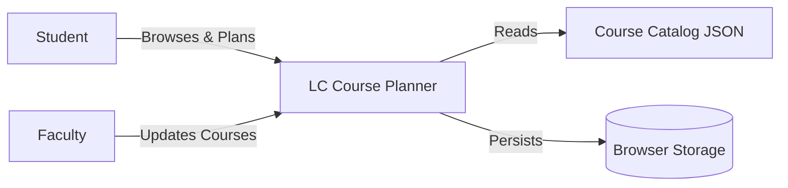
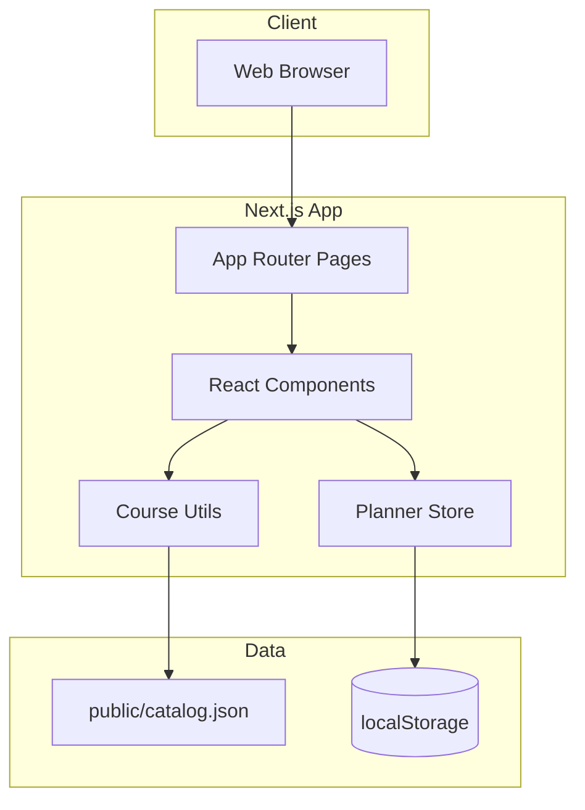
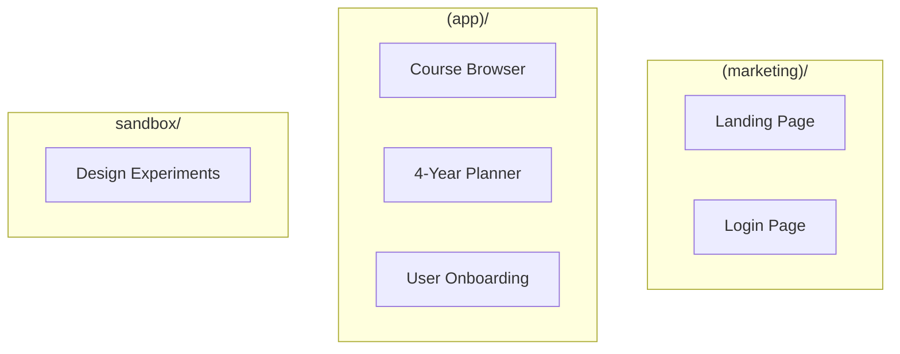
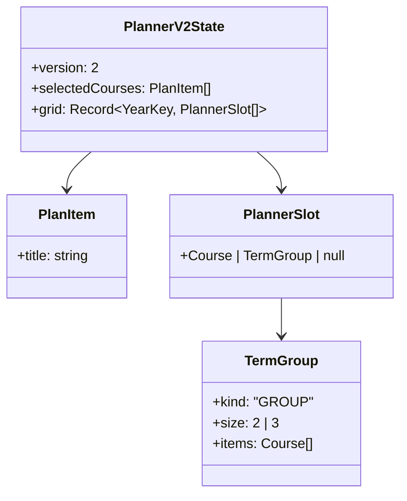

# Architecture Documentation

This document describes the architecture of the Loomis Chaffee Course Planner application.

## System Context

The Loomis Chaffee Course Planner serves students and faculty for course catalog browsing and four-year academic planning:



### Actors

- **Students**: Browse courses, create 4-year plans, manage shopping lists
- **Faculty**: Provide course information (via catalog updates)
- **System**: Validates course data, persists user preferences

## Application Architecture

The application is built with Next.js 15 using the App Router:



### Key Components

| Layer | Responsibility | Examples |
|-------|----------------|----------|
| **Pages** | Route handlers, data fetching | `/browser`, `/planner`, `/sandbox` |
| **Components** | UI rendering, user interaction | `CourseCard`, `PlannerGrid`, `SearchBar` |
| **State** | Client-side state management | `usePlannerStore`, localStorage sync |
| **Utils** | Data transformation, filtering | `flattenDatabase`, course filtering |

## Route Groups

The Next.js App Router uses route groups to separate concerns:



### Route Group Details

| Group | Layout | Purpose |
|-------|--------|---------|
| `(marketing)/` | Minimal chrome | Landing page, login |
| `(app)/` | Full header/nav | Main application features |
| `sandbox/` | Isolated | UI prototyping environment |

## Course Data Pipeline

Course data flows from source PDFs through multiple transformations:

```mermaid
flowchart LR
    PDF[department_pdfs/*.pdf] --> MD[md_conversions/*.md]
    MD --> JSON[json/department.json]
    JSON --> FINAL[json/catalogdbfinal.json]
    FINAL --> APP[public/catalog.json]
    APP --> NORMALIZE[flattenDatabase]
    NORMALIZE --> COURSES[Course[]]
```

### Data Flow Steps

1. **Source**: Department PDFs with course descriptions
2. **Extraction**: Text extracted to Markdown
3. **Normalization**: Converted to JSON by department
4. **Merging**: All departments combined into single catalog
5. **Finalization**: Placed in `public/catalog.json`
6. **Processing**: `flattenDatabase()` converts to `Course[]`

## State Management

The planner uses a custom store with localStorage persistence:



### PlannerV2State Schema

```typescript
PlannerV2State = {
  version: 2,
  selectedCourses: PlanItem[],     // Shopping list
  grid: {
    Freshman: PlannerSlot[],
    Sophomore: PlannerSlot[],
    Junior: PlannerSlot[],
    Senior: PlannerSlot[]
  }
}
```

### Storage

- **Storage Location**: `localStorage` key `loomis-planner-v2`
- **Persistence**: Automatic on state changes
- **Migration**: Version field enables future migrations

## Technology Stack

| Category | Technology |
|----------|------------|
| Framework | Next.js 15 |
| Language | TypeScript 5.0 |
| UI Library | React 19 |
| Styling | Tailwind CSS |
| State Management | Custom hook + localStorage |
| Testing | Vitest, Playwright |

## Configuration Files

| File | Purpose |
|------|---------|
| `tsconfig.json` | TypeScript configuration (strict mode) |
| `tailwind.config.ts` | Tailwind theme and plugins |
| `next.config.js` | Next.js settings |
| `.eslintrc.json` | Linting rules |

## Key File Locations

```
loomis-course-app/
├── src/
│   ├── app/                    # Next.js App Router pages
│   │   ├── (marketing)/        # Landing, login
│   │   ├── (app)/              # Main app pages
│   │   └── sandbox/            # Design experiments
│   ├── components/             # React components
│   ├── lib/                    # Utilities
│   │   ├── courseUtils.ts      # Data processing
│   │   └── plannerStore.ts     # State management
│   └── types/
│       └── course.ts           # Type definitions
├── public/
│   └── catalog.json            # Course data
└── package.json
```

## Related Documentation

- [API Reference](API.md) - Function and type documentation
- [Contributing Guide](../CONTRIBUTING.md) - Development workflow
- [Deployment Guide](DEPLOYMENT.md) - Production deployment
- [Testing Guide](TESTING.md) - Testing practices
- [Architecture Decisions](DECISIONS.md) - ADR summary
